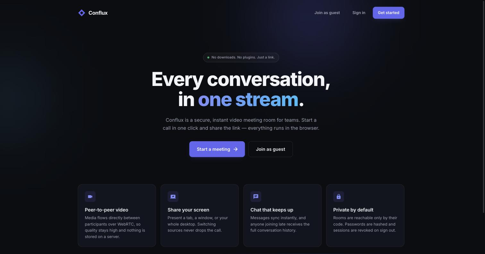
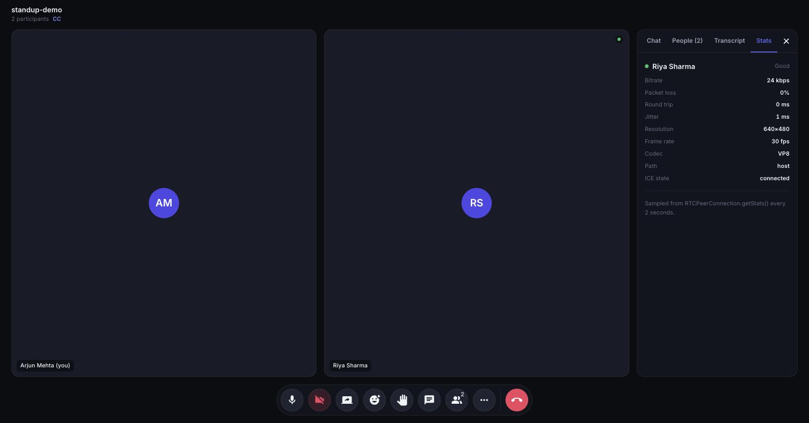

<div align="center">

# ◈ Conflux

**Every conversation, in one stream.**

Peer-to-peer video meetings in the browser — with live captions, AI meeting
summaries, and real WebRTC connection diagnostics.

[](https://github.com/GgauravJ05/conflux/actions/workflows/ci.yml)


[Features](#features) · [Architecture](#architecture) · [Local setup](#local-setup) · [Engineering notes](DECISIONS.md) · [Deployment](#deployment)



</div>

---

## Overview

Conflux lets anyone start a meeting from a link. Media travels **directly
between participants** over WebRTC, so video never passes through — or is stored
on — the server. The backend does two jobs only: authenticating users and
relaying the signalling messages peers need to find each other.

Most of what makes this project interesting is in the parts tutorials stop
before: live `getStats()` diagnostics, automatic ICE restart when a network
drops, `replaceTrack` so screen sharing never renegotiates, and browser-native
speech recognition feeding an AI summariser.

> **Engineering notes:** [`DECISIONS.md`](DECISIONS.md) documents the
> non-obvious trade-offs — why mute toggles `track.enabled` instead of
> re-running `getUserMedia`, why room state is a scaling ceiling, and what I
> would change at 10× the scale.



---

## Features

### The call

| | |
|---|---|
| **Multi-party video** | WebRTC mesh using `addTrack`/`ontrack`, STUN + optional TURN |
| **Adaptive grid** | Tiles reflow for 1 / 2–4 / 5–9 / 10+ participants, with name plates, mute badges, and avatar fallbacks |
| **Pre-join device check** | Camera and mic selection via `enumerateDevices`, live preview, RMS level meter |
| **Screen sharing** | `getDisplayMedia` + `replaceTrack`, so presenting never renegotiates the call |
| **Background blur** | MediaPipe selfie segmentation, composited on a canvas and swapped in via `replaceTrack` |
| **Instant mute** | Toggles `track.enabled` — no renegotiation, no dropped frames |
| **Active speaker** | Loudest participant gets a highlight ring and moves to the front of the grid, with hysteresis so it does not flicker |
| **Local recording** | All tiles composited to a canvas with mixed audio, saved via `MediaRecorder`. Never leaves your machine |

### Knowing what is happening

| | |
|---|---|
| **Connection diagnostics** | Live `RTCPeerConnection.getStats()`: bitrate, packet loss, RTT, jitter, resolution, frame rate, codec, and whether media is going direct or through a TURN relay |
| **Quality indicator** | Each tile carries a green / amber / red dot derived from RTT and loss |
| **Auto-recovery** | Detects `iceConnectionState === "failed"` and performs an ICE restart, so a network change recovers without a reload |

### Working together

| | |
|---|---|
| **Live captions** | Browser-native Web Speech API — no API key, no audio sent to a server I run. Captions are relayed to everyone with speaker attribution |
| **Transcript** | Finalised caption lines build a timestamped, downloadable transcript |
| **AI summary** | Claude turns the transcript into a title, overview, key points, decisions, and owned action items. Optional — the app runs fine without a key |
| **Chat** | Timestamps, sender grouping, unread badge, and backlog replay for late joiners |
| **Presence** | Live roster with names, avatars, mute state, and raised hands |
| **Reactions** | Floating emoji, attributed to the sender |
| **Keyboard shortcuts** | `M` mute · `V` camera · `C` chat · `H` hand · hold `Space` for push-to-talk · `?` for the list |

### Everywhere else

Responsive down to phone widths, labelled controls with visible focus rings,
and `prefers-reduced-motion` support.

---

## Architecture

```
┌──────────────┐        WebRTC media (peer-to-peer)        ┌──────────────┐
│              │◄─────────────────────────────────────────►│              │
│   Browser A  │                                           │   Browser B  │
│   (React)    │                                           │   (React)    │
└──────┬───────┘                                           └───────┬──────┘
       │                                                           │
       │   signalling: SDP offers/answers, ICE candidates          │
       │   + chat, presence, captions, reactions                   │
       └────────────────────────┐         ┌────────────────────────┘
                                ▼         ▼
                        ┌───────────────────────┐
                        │   Express + Socket.IO  │
                        │   ─────────────────    │
                        │   REST: auth, history  │
                        │   REST: AI summary     │──────► Claude API
                        │   WS:   signalling     │        (optional)
                        └───────────┬───────────┘
                                    │
                            ┌───────▼────────┐
                            │    MongoDB     │
                            │ users, history │
                            └────────────────┘
```

**Why a mesh?** Every participant connects directly to every other, so there is
no media server to run and latency stays low. The trade-off is that upload
bandwidth grows linearly with participants — fine up to roughly six people,
which is the target. Scaling past that needs an SFU. See
[`DECISIONS.md` §1](DECISIONS.md).

### Signalling protocol

| Event | Direction | Payload |
|---|---|---|
| `join-call` | client → server | `(roomPath, username)` |
| `user-joined` | server → room | `(socketId, allSocketIds)` |
| `signal` | client ↔ client (relayed) | `(targetId, { sdp \| ice })` |
| `participants` | server → room | `[{ socketId, username, handRaised }]` |
| `media-state` | client → room | `{ video, audio }` |
| `caption` | client → room | `{ text, isFinal }` → `{ speaker, text, isFinal, at }` |
| `reaction` | client → room | `emoji` (server-side allowlist) |
| `raise-hand` | client → room | `boolean` |
| `chat-message` | client → room | `(text, sender, socketId, timestamp)` |
| `user-left` | server → room | `(socketId)` |

`media-state` is relayed explicitly rather than inferred from the media stream,
so a peer's tile greys out the instant they mute instead of waiting on frame
analysis.

---

## Tech stack

**Frontend** — React 18, React Router 6, MUI 5 (custom dark theme + design
tokens), Socket.IO client, WebRTC, Web Speech API, MediaPipe, MediaRecorder
**Backend** — Node.js, Express, Socket.IO, Mongoose, bcrypt, Anthropic SDK
**Database** — MongoDB

---

## Local setup

**Requirements:** Node.js 18+, and MongoDB (local `mongod` or an Atlas cluster).

```bash
git clone https://github.com/GgauravJ05/conflux.git && cd conflux

# --- backend ---
cd backend
npm install
cp .env.example .env          # edit MONGO_URI if needed
npm run dev                   # → http://localhost:8000

# --- frontend (new terminal) ---
cd frontend
npm install
cp .env.example .env
npm start                     # → http://localhost:3000
```

Open the same meeting URL in **two browser tabs** to test a call locally.

> Browsers only grant camera and microphone access on `localhost` or over
> HTTPS. Create React App reads `.env` once at startup — restart the dev server
> after changing it.

### Environment variables

**`backend/.env`**

| Variable | Description | Default |
|---|---|---|
| `PORT` | API + socket server port | `8000` |
| `MONGO_URI` | MongoDB connection string | `mongodb://127.0.0.1:27017/conflux` |
| `CORS_ORIGIN` | Allowed browser origin | `*` |
| `ANTHROPIC_API_KEY` | Enables AI summaries | *(optional)* |

**`frontend/.env`**

| Variable | Description | Default |
|---|---|---|
| `REACT_APP_SERVER_URL` | Backend base URL | `http://localhost:8000` |
| `REACT_APP_TURN_URL` | TURN server URL | *(optional)* |
| `REACT_APP_TURN_USERNAME` | TURN username | *(optional)* |
| `REACT_APP_TURN_CREDENTIAL` | TURN credential | *(optional)* |

---

## API reference

Base path `/api/v1`. Tokens are opaque random strings stored on the user record
and revoked on sign out.

| Method | Endpoint | Body / Query | Success |
|---|---|---|---|
| `GET` | `/health` | — | `200` server + DB status |
| `POST` | `/users/register` | `name`, `username`, `password` | `201` |
| `POST` | `/users/login` | `username`, `password` | `200` `{ token, name, username }` |
| `POST` | `/users/logout` | `token` | `200` |
| `POST` | `/users/add_to_activity` | `token`, `meeting_code` | `201` |
| `GET` | `/users/get_all_activity` | `?token=` | `200` meetings, newest first |
| `GET` | `/ai/status` | — | `200` `{ enabled }` |
| `POST` | `/ai/summary` | `token`, `transcript`, `meetingCode` | `200` structured summary |

Errors return `{ message }` with `400` (validation), `401` (bad credentials or
token), `404` (no such user), `409` (username taken), `429` (model rate limit),
`503` (AI not configured), or `500`.

---

## Testing

```bash
cd frontend && npm test -- --watchAll=false   # component tests
cd frontend && CI=true npm run build          # build + lint
cd backend  && npm start                      # then: curl localhost:8000/health
```

CI runs both on every push: the frontend suite and build, and a backend smoke
test that boots the server against a real MongoDB service container and
exercises register → login → history → AI status.

---

## Deployment

| Layer | Host | Config |
|---|---|---|
| Frontend | Vercel or Netlify | `frontend/vercel.json`, `frontend/public/_redirects` |
| Backend | Render | `backend/render.yaml` |
| Database | MongoDB Atlas (free M0) | — |
| TURN | Metered / Twilio (free tier) | env vars |

1. **Database** — create an Atlas M0 cluster, add a database user, and allow
   access from `0.0.0.0/0` so Render can reach it.
2. **Backend** — create a Render Web Service with root directory `backend`. Set
   `MONGO_URI` and `CORS_ORIGIN`. Render injects `PORT`.
3. **Frontend** — import into Vercel with root directory `frontend`. Set
   `REACT_APP_SERVER_URL` to the Render URL.
4. **TURN** — set the three `REACT_APP_TURN_*` variables, then redeploy.

> **TURN is not optional in practice.** With STUN alone, calls fail whenever a
> participant sits behind symmetric NAT — common on corporate and mobile
> networks. Two people on the same home Wi-Fi connect fine; someone opening the
> link from an office may see nothing.

---

## Project structure

```
backend/
  src/
    app.js                      Express app, Mongo connection, error handling
    controllers/
      user.controller.js        auth + meeting history
      ai.controller.js          Claude summarisation (optional)
      socketManager.js          signalling, presence, chat, captions, reactions
    models/                     User, Meeting
    routes/
frontend/
  src/
    theme.js                    design tokens + MUI theme
    components/                 Logo, AppHeader, Lobby, VideoTile, SidePanel,
                                MeetingControls, CaptionsOverlay, ReactionsLayer,
                                StatsPanel, TranscriptPanel, SummaryDialog,
                                ShortcutsDialog, ToastProvider
    hooks/
      useAudioLevel.js          RMS mic level analysis
      useSpeechRecognition.js   Web Speech API wrapper
      useConnectionStats.js     getStats() parsing and quality rating
      useKeyboardShortcuts.js   in-call shortcuts + push-to-talk
      useBackgroundBlur.js      MediaPipe segmentation pipeline
      useRecorder.js            canvas compositing + MediaRecorder
    contexts/AuthContext.jsx    auth state + API client
    pages/                      landing, authentication, home, history, VideoMeet
```

---

## Known limitations

- **Mesh topology** — practical up to ~6 participants; an SFU is needed beyond.
- **Single backend instance** — room state lives in server memory, so the app
  cannot yet run more than one instance. Redis is the fix.
- **Captions are Chrome/Edge only** — the Web Speech API is not implemented in
  Firefox or Safari. Support is feature-detected and degrades gracefully.
- **No E2EE beyond DTLS-SRTP** — WebRTC's transport encryption applies, but
  there is no additional application-layer encryption.

Each of these is discussed with its trade-off in [`DECISIONS.md`](DECISIONS.md).

---

## Contributing

See [`CONTRIBUTING.md`](CONTRIBUTING.md). The short version: test any call
change with two browser tabs, and run the build with `CI=true` before opening a
PR.

## License

[MIT](LICENSE)
